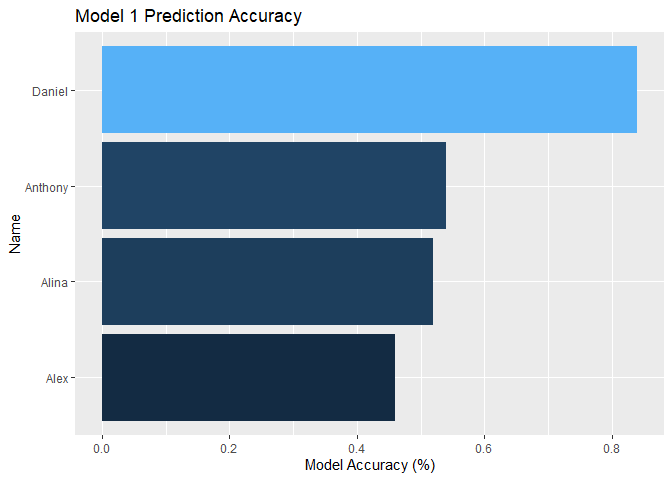
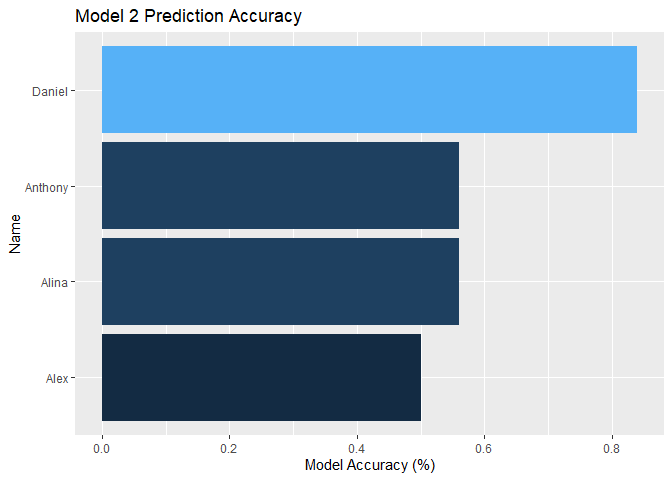
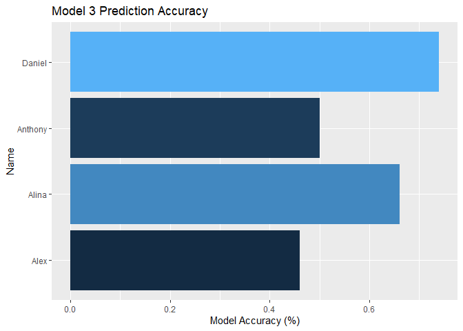
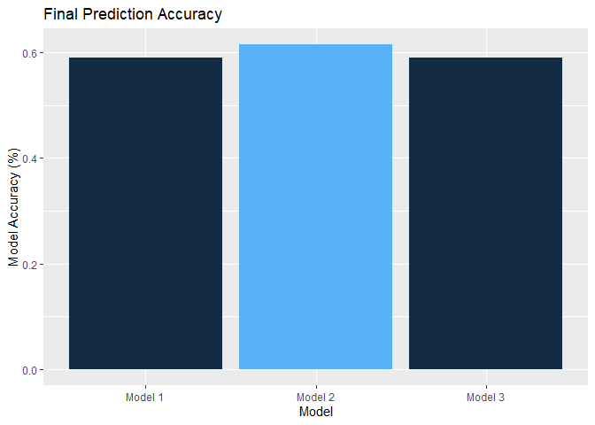
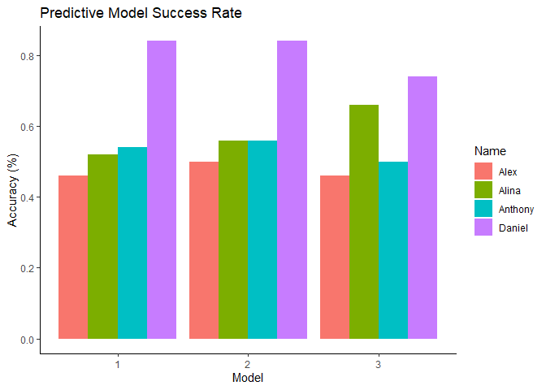
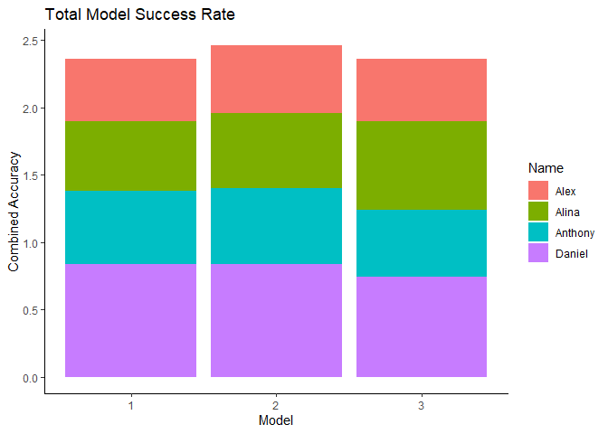

## ANNOTATION CODE

## BATCH QUERY FUNCTIONS

``` r
library(readr)
library(tidyverse)
```

    ## ── Attaching core tidyverse packages ──────────────────────── tidyverse 2.0.0 ──
    ## ✔ dplyr     1.1.4     ✔ purrr     1.0.2
    ## ✔ forcats   1.0.0     ✔ stringr   1.5.1
    ## ✔ ggplot2   3.5.1     ✔ tibble    3.2.1
    ## ✔ lubridate 1.9.4     ✔ tidyr     1.3.1
    ## ── Conflicts ────────────────────────────────────────── tidyverse_conflicts() ──
    ## ✖ dplyr::filter() masks stats::filter()
    ## ✖ dplyr::lag()    masks stats::lag()
    ## ℹ Use the conflicted package (<http://conflicted.r-lib.org/>) to force all conflicts to become errors

``` r
library(dbplyr)
```

    ## 
    ## Attaching package: 'dbplyr'
    ## 
    ## The following objects are masked from 'package:dplyr':
    ## 
    ##     ident, sql

``` r
songs_scaled <- read_csv("songs_scaled.csv")
```

    ## New names:
    ## Rows: 47850 Columns: 14
    ## ── Column specification
    ## ──────────────────────────────────────────────────────── Delimiter: "," dbl
    ## (14): ...1, duration_ms, popularity, danceability, energy, key, loudness...
    ## ℹ Use `spec()` to retrieve the full column specification for this data. ℹ
    ## Specify the column types or set `show_col_types = FALSE` to quiet this message.
    ## • `` -> `...1`

``` r
songs_pca <- read.csv("songs_pca.csv")

df_combined <- read_csv("df_combined.csv")
```

    ## New names:
    ## Rows: 47850 Columns: 16
    ## ── Column specification
    ## ──────────────────────────────────────────────────────── Delimiter: "," chr
    ## (2): artists, track_name dbl (14): ...1, duration_ms, popularity, danceability,
    ## energy, key, loudness...
    ## ℹ Use `spec()` to retrieve the full column specification for this data. ℹ
    ## Specify the column types or set `show_col_types = FALSE` to quiet this message.
    ## • `` -> `...1`

``` r
# extract song names
song_name <- df_combined[,(2:3)]
# Set all as numeric
songs <- df_combined[c(-1:-3)]
songs[] <- lapply(songs, function(x) as.numeric(as.character(x)))

# Load K-means Model
kmeans_result <- readRDS("kmeans_model.rds")
```

``` r
library(FNN)
```

    ## Warning: package 'FNN' was built under R version 4.4.3

``` r
library(dplyr)

batch_knn_standard <- function(query_indices, songs_scaled, song_name, k) {
  all_results <- list()

  for (query_index in query_indices) {
    query_point <- songs_scaled[query_index, , drop = FALSE]
    knn_result <- get.knnx(data = songs_scaled, query = query_point, k = k + 1)  
    
    neighbor_indices <- knn_result$nn.index[1, ]
    neighbor_distances <- knn_result$nn.dist[1, ]

    # Remove first Neighhor (Self)
    neighbor_indices <- neighbor_indices[-1]
    neighbor_distances <- neighbor_distances[-1]
    
    # Extract Song Names
    neighbors_data <- song_name[neighbor_indices, , drop = FALSE]

    # 5. Save neighbors with query_id
    result_df <- data.frame(
      query_id = query_index,
      neighbor_text = apply(neighbors_data, 1, paste, collapse = " - "),
      stringsAsFactors = FALSE
    )

    all_results[[as.character(query_index)]] <- result_df
  }

  final_df <- bind_rows(all_results)
  return(final_df)
}
```

``` r
library(FNN)
library(dplyr)

batch_clustered_knn <- function(query_indices, kmeans_result, data, song_name, k = 6) {
  all_results <- list()

  for (query_index in query_indices) {
    # Identify cluster of the query point
    query_cluster <- kmeans_result$cluster[query_index]
    cluster_indices <- which(kmeans_result$cluster == query_cluster)

    # Get cluster-specific data
    cluster_songs <- data[cluster_indices, , drop = FALSE]
    cluster_song_names <- song_name[cluster_indices, ]

    # Locate query within the cluster
    relative_query_index <- match(query_index, cluster_indices)
    query_point <- cluster_songs[relative_query_index, , drop = FALSE]

    # Run KNN in the cluster
    knn_result <- get.knnx(data = cluster_songs, query = query_point, k = k + 1)

    neighbor_indices <- knn_result$nn.index[1, ]
    neighbor_indices <- neighbor_indices[neighbor_indices != relative_query_index]  # remove self
    neighbors_data <- cluster_song_names[neighbor_indices, , drop = FALSE]

    # Build results with query ID
    result_df <- data.frame(
      query_id = query_index,
      neighbor_text = apply(neighbors_data, 1, paste, collapse = " - "),
      stringsAsFactors = FALSE
    )

    all_results[[as.character(query_index)]] <- result_df
  }

  final_df <- bind_rows(all_results)
  return(final_df)
}
```

``` r
library(dplyr)
library(tidyr)
library(stringr)
library(spotifyr)

format_neighbors_with_spotify_urls <- function(neighbors_df, k = 5) {
  access_token <- get_spotify_access_token()

  # Step 1: Extract artist and track name
  split_df <- neighbors_df %>%
    mutate(rank = row_number(),
           artist = str_trim(str_extract(neighbor_text, "^[^–-]+")),
           track_name = str_trim(str_remove(neighbor_text, "^[^–-]+[-–]")))

  # Step 2: Lookup Spotify URLs
  get_spotify_url <- function(artist, track) {
    query <- paste(artist, track)
    result <- tryCatch({
      search_spotify(query, type = "track", limit = 1, market = "US")
    }, error = function(e) NULL)

    if (!is.null(result) && nrow(result) > 0) {
      return(result$external_urls.spotify[1])
    } else {
      return(NA)
    }
  }

  split_df$spotify_url <- mapply(get_spotify_url, split_df$artist, split_df$track_name)

  # Step 3: Rank neighbors per query_id
  split_df <- split_df %>%
    group_by(query_id) %>%
    mutate(rank = row_number()) %>%
    filter(rank <= k) %>%
    ungroup()

  # Step 4: Pivot to wide format
  formatted <- split_df %>%
    mutate(
      rec_col = paste0("Model Rec ", rank),
      url_col = paste0("Song URL ", rank),
      annotation_col = paste0("Annotation ", rank)
    ) %>%
    select(query_id, rank, neighbor_text, spotify_url) %>%
    pivot_wider(
      names_from = rank,
      values_from = c(neighbor_text, spotify_url),
      names_glue = "{.value} {rank}"
    )

  # Step 5: Add empty annotation columns
  for (i in 1:k) {
    formatted[[paste0("Annotation ", i)]] <- ""
  }

  # Step 6: Reorder to match Excel layout
  formatted <- formatted %>%
    relocate(query_id,
      starts_with("neighbor_text 1"), starts_with("spotify_url 1"), starts_with("Annotation 1"),
      starts_with("neighbor_text 2"), starts_with("spotify_url 2"), starts_with("Annotation 2"),
      starts_with("neighbor_text 3"), starts_with("spotify_url 3"), starts_with("Annotation 3"),
      starts_with("neighbor_text 4"), starts_with("spotify_url 4"), starts_with("Annotation 4"),
      starts_with("neighbor_text 5"), starts_with("spotify_url 5"), starts_with("Annotation 5")
    )

  # Optional: Rename columns for final polish
  names(formatted) <- names(formatted) %>%
    str_replace("neighbor_text", "Model Rec") %>%
    str_replace("spotify_url", "Song URL")

  return(formatted)
}
```

## PLAYLIST QUERIES

``` r
# Query songs by index (e.g., row numbers in your scaled data)
query_set <- c(34,5253,28496,5851,9422,11895,9135,46249,28518,3176) # ALI
# query_set <- c(13,16,324,2055,1384,29,1235,1433,108,370) # DANIEL
# query_set <- c(454,162,194,770,1419,9121,9142,5126,26344,5930) #ALEX
# query_set <- c(57,58,99,129,355,5103,9608,12844,19342) #ANTHONY


# Run batch standard KNN
neighbors_df_s <- batch_knn_standard(
  query_indices = query_set,
  songs_scaled = songs_scaled,
  song_name = song_name,
  k = 6
)

# Run batch clustered KNN
neighbors_df_c <- batch_clustered_knn(
  query_indices = query_set,
  kmeans_result = kmeans_result,
  data = songs_scaled,
  song_name = song_name,
  k = 6
)

# Run batch clustered KNN + PCA
neighbors_df_pca <- batch_clustered_knn(
  query_indices = query_set,
  kmeans_result = kmeans_result,
  data = songs_pca,
  song_name = song_name,
  k = 6
)

View(neighbors_df_c)
```

``` r
model1 <- format_neighbors_with_spotify_urls(neighbors_df_s, k = 5)
model2 <- format_neighbors_with_spotify_urls(neighbors_df_c, k = 5)
model3 <- format_neighbors_with_spotify_urls(neighbors_df_pca, k = 5)

#write.csv(model1, "x1.csv")
#write.csv(model2, "x2.csv")
#write.csv(model3, "x3.csv")
```

## EVALUATION RESULTS

|  | Model 1 Songs Liked | Model 1 Songs Disliked | Model 1 Final Percent | Model 2 Songs Liked | Model 2 Songs Disliked | Model 2 Final Percent | Model 3 Songs Liked | Model 3 Songs Disliked | Model 3 Final Percent |
|----|----|----|----|----|----|----|----|----|----|
| Alina | 26 | 24 | 0.52 | 28 | 22 | 0.56 | 33 | 17 | 0.66 |
| Daniel | 42 | 8 | 0.84 | 42 | 8 | 0.84 | 37 | 13 | 0.74 |
| Alex | 23 | 27 | 0.46 | 25 | 25 | 0.50 | 23 | 27 | 0.46 |
| Anthony | 27 | 23 | 0.54 | 28 | 22 | 0.56 | 25 | 25 | 0.50 |

``` r
library(ggplot2)


music_results <- read.csv("Book1.csv")

colnames(music_results) <- c('Name', 'Model1', 'Model2', 'Model3')

finalResults <- c(0.59, 0.615, 0.59)
finalModels <- c("Model 1", "Model 2", "Model 3")
final_df <- data.frame(finalModels, finalResults)

#Individual Plots

ggplot(music_results, aes(x = Name, y = Model1)) +
  geom_col(data = music_results, aes(fill = Model1)) +
  theme(legend.position = "none") +
  labs(x = "Name", y = "Model Accuracy (%)", title = "Model 1 Prediction Accuracy") +
  coord_flip() 
```

<!-- -->

``` r
ggplot(music_results, aes(x = Name, y = Model2)) +
  geom_col(data = music_results, aes(fill = Model2)) +
  theme(legend.position = "none") +
  labs(x = "Name", y = "Model Accuracy (%)", title = "Model 2 Prediction Accuracy") +
  coord_flip()
```

<!-- -->

``` r
ggplot(music_results, aes(x = Name, y = Model3)) +
  geom_col(data = music_results, aes(fill = Model3)) +
  theme(legend.position = "none") +
  labs(x = "Name", y = "Model Accuracy (%)", title = "Model 3 Prediction Accuracy") +
  coord_flip()
```

<!-- -->

``` r
ggplot(final_df, aes(x = finalModels, y = finalResults)) +
  geom_col(data = final_df, aes(fill = finalResults)) +
  theme(legend.position = "none") +
  labs(x = "Model", y = "Model Accuracy (%)", title = "Final Prediction Accuracy")
```

<!-- -->

``` r
#Faceted Plot

faceted_df <- read.csv("Book2.csv")
colnames(faceted_df) <- c("Name", "Model", "Accuracy")

ggplot(faceted_df, aes(x = Model, y = Accuracy)) +
  geom_bar(stat = "identity", position = "dodge", aes(fill = Name)) +
  labs(x = "Model", y = "Accuracy (%)", title = "Predictive Model Success Rate") +
  theme_classic()
```

<!-- -->

``` r
ggplot(faceted_df, aes(x = Model, y = Accuracy)) +
  geom_bar(stat = "identity", aes(fill = Name)) +
  labs(x = "Model", y = "Combined Accuracy", title = "Total Model Success Rate") +
  theme_classic()
```

<!-- -->
